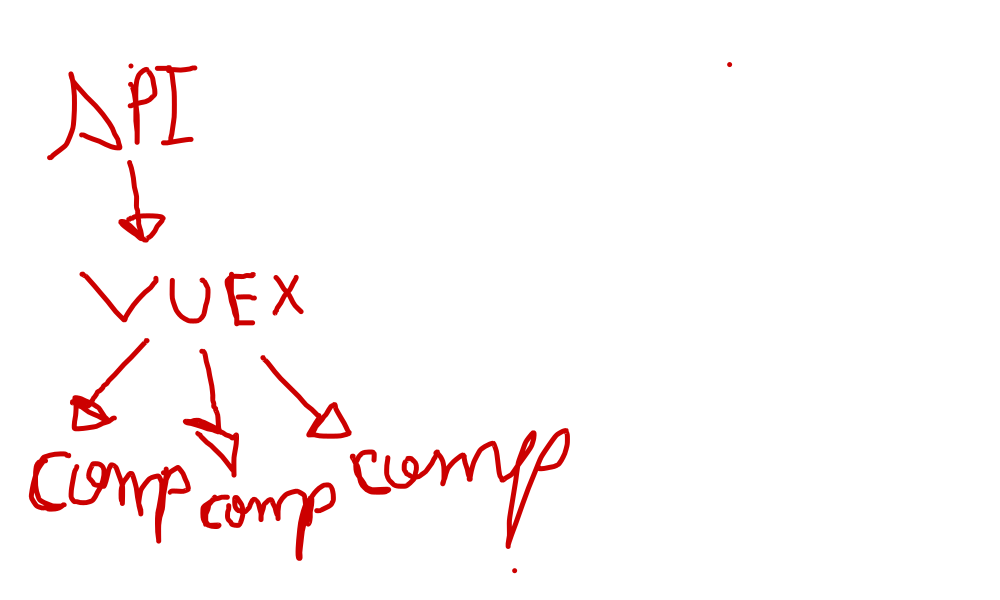
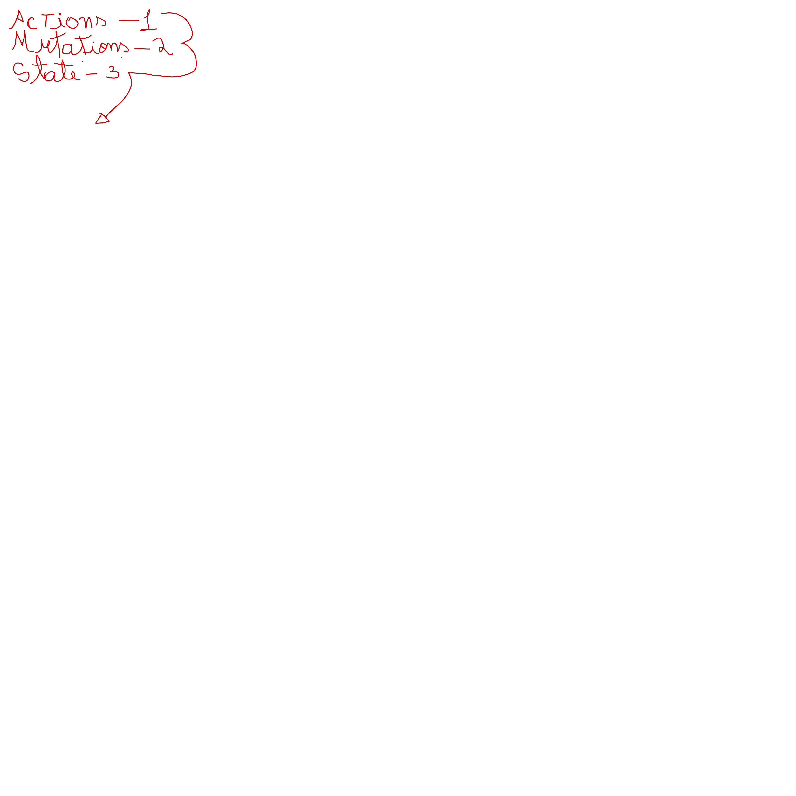

# Vuex

Pode ser considerado tipo um "middleware"

Ele fica responsável por ser o intermediador entre a API e os Componentes.

`API => Vuex => Componentes`



## Atributos do VUEX

- state:{} - controla o estado;
- mutations:{} - muda o estado;
- actions:{} - ações dentro de um determinado contexto;
- modules:{} - divisões unicas que contém `states, mutations e actions` cuidado de determinados modulos

## Ordem lógica do vuex



Uma AÇÃO deve chamar uma MUTAÇÃO para alterar um ESTADO;

**mutations** são funções sincronas, ou seja, quando é disparada o sistema tem que esperar a finalização da mutation.

**action** são funções assincronas, `async` que podem ser executadas e não necessitam esperar a sua finalização.

Não é obrigatorio usar a action junto com o mutation. Se utiliza action quando necessita de uma promisse, normalmente quando se faz uma requisção para a API ou qualquer tarefa que seja necessário o uso de uma promisse.

$store -> acesso o state do vuex.

Tudo que for alterado no vuex será replicado nos componentes

para chamar uma **action** usa-se o `store.dispatch`
para chamar uma **mutation** usa-se o `store.commit`

Uma action recebe como parametro um `context` e um `payload`.

Uma mutation recebe como parametro um `state` e um `payload`.

Caso haja uma repetição no fluxo da utilização de uma action para uma mutation, deve-se analisar se o uso da action é necessária, não sendo pode-se utilizar a mutation direto.

## Strict Mode

O stric mode quando estiver true dentro do store, não vai permitir alterar estados sem antes passar nas mutations.

A computed é nativamente onde ficará os getters e setters

## map

- 𝐦𝐚𝐩𝐒𝐭𝐚𝐭𝐞 é um auxiliar que simplifica a criação de uma propriedade computada que reflete o valor de um determinado estado.
- 𝐦𝐚𝐩𝐆𝐞𝐭𝐭𝐞𝐫𝐬 é um helper que simplifica a criação de uma propriedade computada que reflete o valor retornado por um determinado getter.
- 𝐦𝐚𝐩𝐀𝐜𝐭𝐢𝐨𝐧𝐬 é um helper que simplifica a criação de um método que seria equivalente a chamar dispatch em uma ação.
- 𝐦𝐚𝐩𝐌𝐮𝐭𝐚𝐭𝐢𝐨𝐧𝐬 é um helper que simplifica a criação de um método que seria equivalente a chamar commit em uma mutação.

mapGetters:
 Ele recebe 2 parametros

  ```ts
 mapGetters({
 nomeDoMetodoQueSeraUsadoNoComponente: "metodoQueSeraMapeadoNoStore"
 })
  ```

O nome do método pode ser qualuqer um, mas o quer será mapeado
precisa ser o que existe dentro do store.

Caso os métodos que obtenham o mesmo nome, você pode criar um array e utilizar o mesmo nome no componente.

```ts
  mapGetters['metodoQueVaiSerMapeados']
```

Quando se tem mais de um método a ser utilizado dentro da computed, usa-se o spreed operator.

A mesma lógica serve para o mapState, mapAction e mapMutation.

Este [vídeo](https://youtu.be/ksDmbBqpw2A) explica muito bem o conceito de mapGetters, mapState, mapAction e mapMutation.
